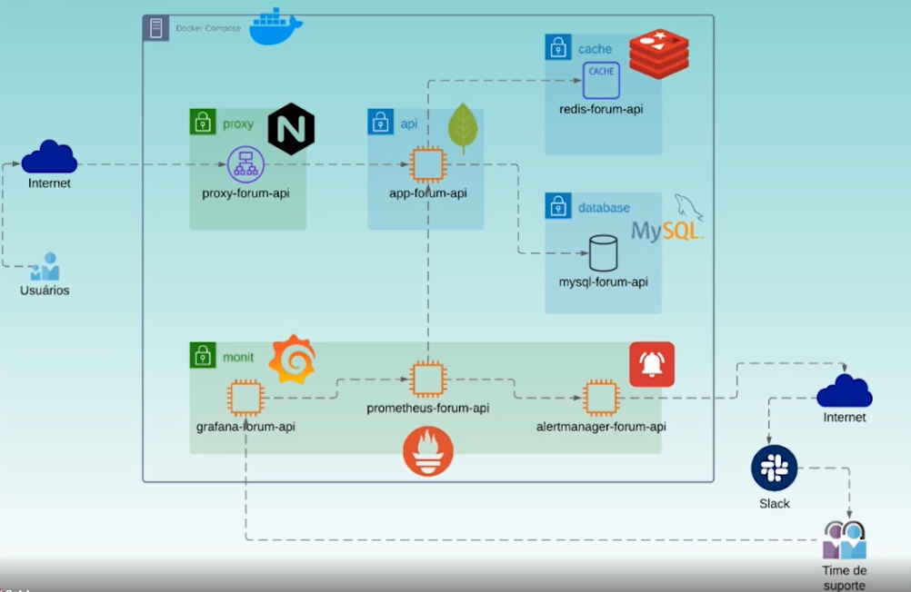

# <b>Observabilidade</b>: coletando métricas de uma aplicação com Prometheus

  

    <h2><b>Observabilidade e Monitoramento</b></h2>
    <ul>
      <li>
        <h3>Observabilidade consiste em acompanhar o estado de execução de um sistema através da externalização de seu comportamento em tempo de execução.</h3>
      </li>
      <li>
        <h3>Monitoramento consiste em acompanhar o estado de um sistemas através de eventos registrados e executar ações como resposta a estes eventos.</h3>
      </li>
    </ul>
  

  

    <h2><b>O que são métricas?</b></h2>
    <ul>
      <li>
        <h3>Uma métrica é um indicador de nível de serviço coletado dentro de uma série temporal, métricas serão utilizadas para medir performance, 
            disponibilidade, saturação, erros e qualquer informação útil para oo negócio.</h3>
      </li>
      <li>
        <h3>Uma métrica possui objetivo especifíco, para cada ponto de atenção em um sistema, deve existir uma métrica correspondente.</h3>
      </li>
    </ul>
  

  
  <h2><b>Desenho da proposta do curso:</b></h2>
  
  
  
  <h3>Curso da plataforma <b><i>Alura</i></b>, na trilha de Observabilidade e ministrado por <b><i>Kleber de Paiva Siqueira Costa</i></b>.</h3>